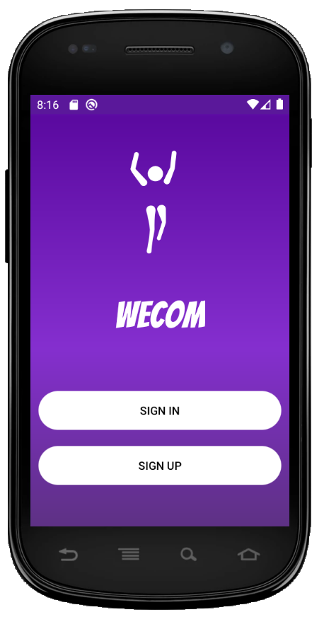
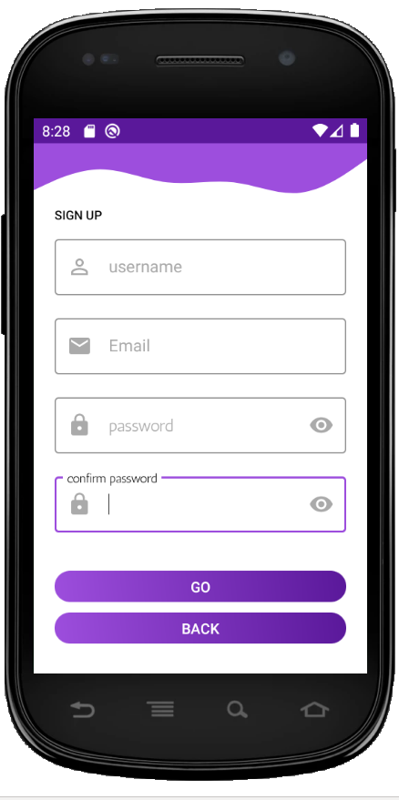
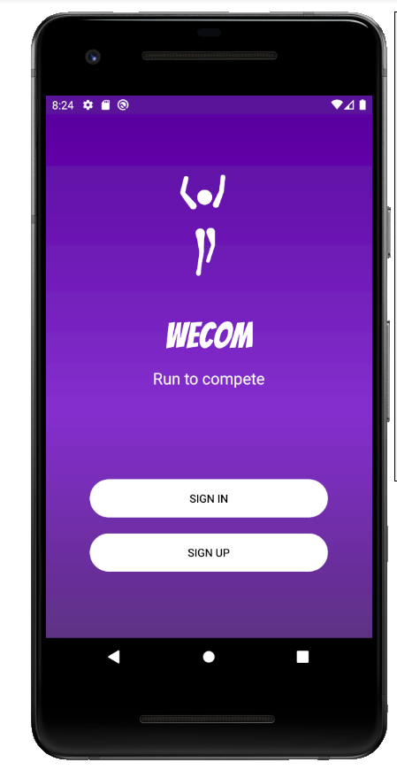
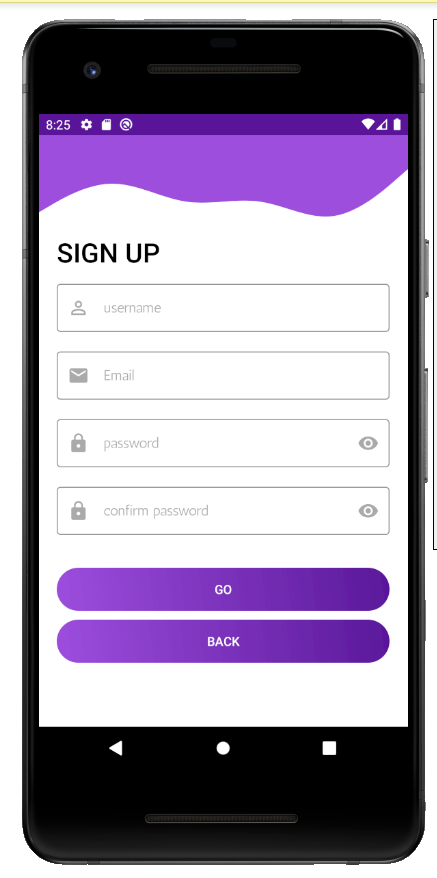

# wecom - Android-App      
  

 ## Discription 
 -------------------------------------------------------
. This app is a usefull light-weight android exercise tracking app.
- The app has a special feature of instant prizing.
- The app uses both Room and Firebase Firestore for an offline and online data access 
- The app is build using MVVM architecture 
- The app uses coroutines for background tasks
- The app uses Hilt for dependency Injection
- the app use foregroind service 
- The app uses location sensor
- The app is written in Kotlin 
---

 ## Features     
    
 -----------------------------------------------------

 
 |  Min SDK Version | Version Name  | SDK Version |
 | ---------------- |:-------------:| ----------  |
 |  23              |  1.0          |      30     |

 
 
 - Instant Prizing    
 - lottie animations 
 - flat icons 
 - transition animation
 - material design components
 - scrachview libraray for revealing user competition rank 

---------------------------------------------------------

## Design pattern /architecture

- Model View ViewModel

-----------------------------------------------------------

## External Librarys 

 
 |  Librarys           |           usage                                     | 
 | ----------------    |:----------------------------------------------------|
   scarachview
 -----------------------------------------------------------------------------
 |  LottieFiels        |  for animation                                      |
 -----------------------------------------------------------------------------
 |  material design    |  for material components                            |
 -----------------------------------------------------------------------------
 |  Dagger-Hilt        |  for dependency-Injection                           |
 -----------------------------------------------------------------------------
 
## photos

---------------------

  
 

